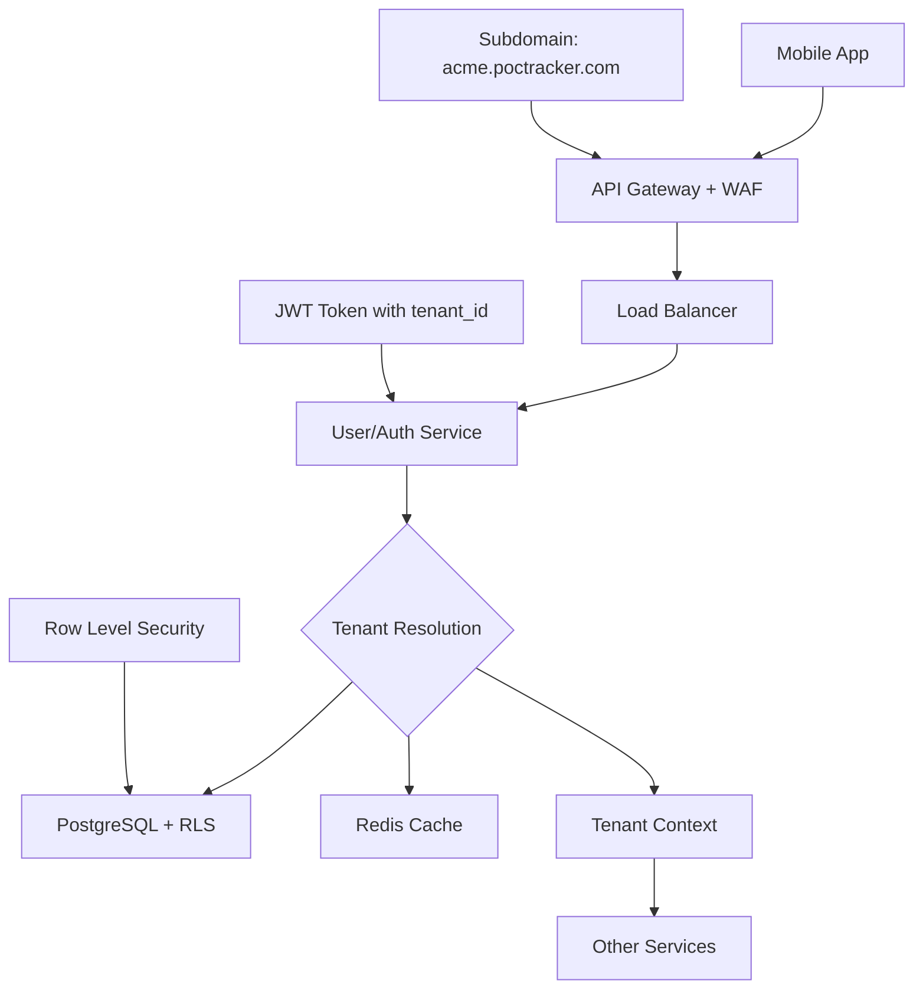

# 🔐 Multi-Tenant User/Auth Service - Deep Implementation Guide

## 📋 Table of Contents
1. [Multi-Tenancy Patterns Overview](#multi-tenancy-patterns)
2. [Chosen Architecture Deep Dive](#chosen-architecture)
3. [Database Schema Design](#database-schema)
4. [Authentication Flow Implementation](#authentication-flow)
5. [Tenant Isolation Strategies](#tenant-isolation)
6. [Technology Stack Deep Dive](#technology-stack)
7. [Security Implementation](#security-implementation)
8. [Code Examples & Implementation](#code-examples)
9. [Performance & Scalability](#performance-scalability)
10. [Monitoring & Observability](#monitoring)

## 🏗️ Multi-Tenancy Patterns Overview

### Pattern Comparison Matrix

| Pattern | Data Isolation | Cost Efficiency | Complexity | Scalability | Customization |
|---------|---------------|-----------------|------------|-------------|---------------|
| **Database per Tenant** | ⭐⭐⭐⭐⭐ | ⭐⭐ | ⭐⭐⭐⭐ | ⭐⭐⭐ | ⭐⭐⭐⭐⭐ |
| **Schema per Tenant** | ⭐⭐⭐⭐ | ⭐⭐⭐ | ⭐⭐⭐ | ⭐⭐⭐⭐ | ⭐⭐⭐⭐ |
| **Shared Database + Row-Level Security** | ⭐⭐⭐ | ⭐⭐⭐⭐⭐ | ⭐⭐ | ⭐⭐⭐⭐⭐ | ⭐⭐ |

### 🎯 Our Choice: Shared Database + Row-Level Security (RLS)

**Why this pattern for POC Tracker:**
- **Cost Efficient**: Single database infrastructure for all tenants
- **Brazilian Market Focus**: Cost optimization crucial for emerging market
- **Simplified Operations**: One database to backup, monitor, and maintain
- **PostgreSQL Native RLS**: Robust tenant isolation at database level
- **Horizontal Scaling**: Can shard later when needed

## 🏛️ Chosen Architecture Deep Dive

### High-Level Multi-Tenant Flow



### Tenant Resolution Strategy

```typescript
// Tenant resolution hierarchy (in order of precedence)
enum TenantResolutionStrategy {
  JWT_CLAIM = 'jwt_claim',           // tenant_id in JWT token
  SUBDOMAIN = 'subdomain',           // acme.poctracker.com
  HEADER = 'x-tenant-id',            // Custom header
  QUERY_PARAM = 'tenant_id',         // ?tenant_id=uuid
  DEFAULT = 'default'                // Fallback tenant
}
```

## 🗄️ Database Schema Design

### Core Multi-Tenant Schema

```sql
-- =============================================================================
-- TENANT MANAGEMENT SCHEMA
-- =============================================================================

-- Main tenants table
CREATE TABLE tenants (
    id UUID PRIMARY KEY DEFAULT gen_random_uuid(),
    name VARCHAR(255) NOT NULL,
    subdomain VARCHAR(100) UNIQUE NOT NULL,
    
    -- Subscription and limits
    plan_type VARCHAR(50) NOT NULL DEFAULT 'basic',
    max_users INTEGER DEFAULT 10,
    max_pocs INTEGER DEFAULT 100,
    max_storage_gb INTEGER DEFAULT 5,
    
    -- Features enabled
    features JSONB DEFAULT '{
        "real_time_dojos": true,
        "video_generation": false,
        "advanced_analytics": false,
        "api_access": false
    }',
    
    -- Customization
    branding JSONB DEFAULT '{
        "logo_url": null,
        "primary_color": "#2563eb",
        "custom_domain": null
    }',
    
    -- Administrative
    status VARCHAR(20) DEFAULT 'active',
    created_at TIMESTAMP DEFAULT NOW(),
    updated_at TIMESTAMP DEFAULT NOW(),
    deleted_at TIMESTAMP NULL,
    
    -- Billing
    billing_email VARCHAR(255),
    subscription_ends_at TIMESTAMP,
    
    CONSTRAINT valid_plan_type CHECK (plan_type IN ('basic', 'pro', 'enterprise')),
    CONSTRAINT valid_status CHECK (status IN ('active', 'suspended', 'canceled'))
);

-- Tenant settings for feature flags and configuration
CREATE TABLE tenant_settings (
    id UUID PRIMARY KEY DEFAULT gen_random_uuid(),
    tenant_id UUID NOT NULL REFERENCES tenants(id) ON DELETE CASCADE,
    setting_key VARCHAR(255) NOT NULL,
    setting_value JSONB NOT NULL,
    created_at TIMESTAMP DEFAULT NOW(),
    updated_at TIMESTAMP DEFAULT NOW(),
    
    UNIQUE(tenant_id, setting_key)
);

-- =============================================================================
-- USER MANAGEMENT SCHEMA WITH RLS
-- =============================================================================

-- Users table with Row Level Security
CREATE TABLE users (
    id UUID PRIMARY KEY DEFAULT gen_random_uuid(),
    tenant_id UUID NOT NULL REFERENCES tenants(id) ON DELETE CASCADE,
    
    -- Authentication
    email VARCHAR(255) NOT NULL,
    password_hash VARCHAR(255) NOT NULL,
    email_verified_at TIMESTAMP NULL,
    
    -- Profile
    first_name VARCHAR(100) NOT NULL,
    last_name VARCHAR(100) NOT NULL,
    avatar_url VARCHAR(500),
    timezone VARCHAR(50) DEFAULT 'America/Sao_Paulo',
    locale VARCHAR(10) DEFAULT 'pt-BR',
    
    -- Authorization
    role VARCHAR(50) NOT NULL DEFAULT 'user',
    permissions JSONB DEFAULT '[]',
    
    -- Status and tracking
    status VARCHAR(20) DEFAULT 'active',
    last_login_at TIMESTAMP,
    login_count INTEGER DEFAULT 0,
    
    -- Audit
    created_at TIMESTAMP DEFAULT NOW(),
    updated_at TIMESTAMP DEFAULT NOW(),
    created_by UUID REFERENCES users(id),
    
    -- Constraints
    CONSTRAINT valid_role CHECK (role IN ('admin', 'manager', 'user', 'viewer')),
    CONSTRAINT valid_status CHECK (status IN ('active', 'inactive', 'suspended')),
    UNIQUE(tenant_id, email)
);

-- User sessions for JWT management and security
CREATE TABLE user_sessions (
    id UUID PRIMARY KEY DEFAULT gen_random_uuid(),
    user_id UUID NOT NULL REFERENCES users(id) ON DELETE CASCADE,
    tenant_id UUID NOT NULL,
    
    -- Session data
    refresh_token_hash VARCHAR(255) NOT NULL,
    device_info JSONB DEFAULT '{}',
    ip_address INET,
    user_agent TEXT,
    
    -- Expiration and status
    expires_at TIMESTAMP NOT NULL,
    last_used_at TIMESTAMP DEFAULT NOW(),
    is_active BOOLEAN DEFAULT true,
    
    -- Audit
    created_at TIMESTAMP DEFAULT NOW(),
    
    CONSTRAINT fk_user_sessions_tenant 
        FOREIGN KEY (tenant_id) REFERENCES tenants(id) ON DELETE CASCADE
);

-- =============================================================================
-- ROW LEVEL SECURITY POLICIES
-- =============================================================================

-- Enable RLS on users table
ALTER TABLE users ENABLE ROW LEVEL SECURITY;

-- Policy: Users can only see users from their tenant
CREATE POLICY tenant_isolation_users ON users
    FOR ALL
    TO authenticated_user
    USING (tenant_id = current_setting('app.current_tenant_id')::UUID)
    WITH CHECK (tenant_id = current_setting('app.current_tenant_id')::UUID);

-- Policy: Super admin can see all users (for system maintenance)
CREATE POLICY super_admin_users ON users
    FOR ALL
    TO super_admin
    USING (true);

-- Enable RLS on user_sessions
ALTER TABLE user_sessions ENABLE ROW LEVEL SECURITY;

-- Policy: Sessions isolated by tenant
CREATE POLICY tenant_isolation_sessions ON user_sessions
    FOR ALL
    TO authenticated_user
    USING (tenant_id = current_setting('app.current_tenant_id')::UUID);

-- =============================================================================
-- INDEXES FOR PERFORMANCE
-- =============================================================================

-- Critical indexes for multi-tenant queries
CREATE INDEX idx_users_tenant_id ON users(tenant_id);
CREATE INDEX idx_users_email_tenant ON users(tenant_id, email);
CREATE INDEX idx_users_role_tenant ON users(tenant_id, role);
CREATE INDEX idx_users_status_tenant ON users(tenant_id, status);

CREATE INDEX idx_sessions_user_tenant ON user_sessions(user_id, tenant_id);
CREATE INDEX idx_sessions_token ON user_sessions(refresh_token_hash);
CREATE INDEX idx_sessions_expires ON user_sessions(expires_at) WHERE is_active = true;

CREATE INDEX idx_tenants_subdomain ON tenants(subdomain);
CREATE INDEX idx_tenants_status ON tenants(status) WHERE status = 'active';

-- =============================================================================
-- FUNCTIONS AND TRIGGERS
-- =============================================================================

-- Function to set tenant context
CREATE OR REPLACE FUNCTION set_tenant_context(tenant_uuid UUID)
RETURNS void AS $$
BEGIN
    PERFORM set_config('app.current_tenant_id', tenant_uuid::text, true);
END;
$$ LANGUAGE plpgsql SECURITY DEFINER;

-- Function to validate tenant access
CREATE OR REPLACE FUNCTION validate_tenant_access(user_uuid UUID, tenant_uuid UUID)
RETURNS boolean AS $$
DECLARE
    user_exists boolean;
BEGIN
    SELECT EXISTS(
        SELECT 1 FROM users 
        WHERE id = user_uuid AND tenant_id = tenant_uuid AND status = 'active'
    ) INTO user_exists;
    
    RETURN user_exists;
END;
$$ LANGUAGE plpgsql SECURITY DEFINER;

-- Trigger to update updated_at timestamp
CREATE OR REPLACE FUNCTION update_updated_at()
RETURNS TRIGGER AS $$
BEGIN
    NEW.updated_at = NOW();
    RETURN NEW;
END;
$$ LANGUAGE plpgsql;

-- Apply update trigger to relevant tables
CREATE TRIGGER trigger_users_updated_at 
    BEFORE UPDATE ON users 
    FOR EACH ROW EXECUTE FUNCTION update_updated_at();

CREATE TRIGGER trigger_tenants_updated_at 
    BEFORE UPDATE ON tenants 
    FOR EACH ROW EXECUTE FUNCTION update_updated_at();
```

## 🔐 Authentication Flow Implementation

### JWT Token Structure

```typescript
interface JWTPayload {
  // Standard claims
  sub: string;          // user_id
  iss: string;          // 'poc-tracker-auth'
  aud: string;          // 'poc-tracker-api'
  exp: number;          // expiration timestamp
  iat: number;          // issued at timestamp
  jti: string;          // JWT ID for revocation
  
  // Custom claims
  tenant_id: string;    // Critical for multi-tenancy
  tenant_subdomain: string;
  user_role: string;    // 'admin' | 'manager' | 'user' | 'viewer'
  permissions: string[]; // Granular permissions
  plan_type: string;    // Tenant plan for feature gating
  
  // Session tracking
  session_id: string;   // For session management
  device_id?: string;   // Optional device tracking
}
```

### Authentication Service Implementation

```typescript
// =============================================================================
// AUTHENTICATION SERVICE
// =============================================================================

import jwt from 'jsonwebtoken';
import bcrypt from 'bcryptjs';
import { v4 as uuidv4 } from 'uuid';
import { DatabaseService } from './database.service';
import { TenantService } from './tenant.service';
import { RedisService } from './redis.service';

export class AuthService {
  constructor(
    private db: DatabaseService,
    private tenantService: TenantService,
    private redis: RedisService
  ) {}

  /**
   * Register new user with tenant validation
   */
  async registerUser(params: {
    email: string;
    password: string;
    firstName: string;
    lastName: string;
    tenantId: string;
    inviteToken?: string;
  }): Promise<AuthResult> {
    
    // 1. Validate tenant exists and is active
    const tenant = await this.tenantService.getTenantById(params.tenantId);
    if (!tenant || tenant.status !== 'active') {
      throw new AuthError('Invalid tenant', 'INVALID_TENANT');
    }

    // 2. Check tenant user limits
    const userCount = await this.getUserCountForTenant(params.tenantId);
    if (userCount >= tenant.max_users) {
      throw new AuthError('Tenant user limit exceeded', 'USER_LIMIT_EXCEEDED');
    }

    // 3. Validate invite token if provided
    if (params.inviteToken) {
      await this.validateInviteToken(params.inviteToken, params.tenantId);
    }

    // 4. Set tenant context for RLS
    await this.db.query('SELECT set_tenant_context($1)', [params.tenantId]);

    // 5. Check if user already exists in tenant
    const existingUser = await this.db.query(
      'SELECT id FROM users WHERE tenant_id = $1 AND email = $2',
      [params.tenantId, params.email.toLowerCase()]
    );

    if (existingUser.rows.length > 0) {
      throw new AuthError('User already exists', 'USER_EXISTS');
    }

    // 6. Hash password
    const passwordHash = await bcrypt.hash(params.password, 12);

    // 7. Create user
    const userResult = await this.db.query(`
      INSERT INTO users (
        tenant_id, email, password_hash, first_name, last_name, role
      ) VALUES ($1, $2, $3, $4, $5, $6)
      RETURNING id, email, first_name, last_name, role, created_at
    `, [
      params.tenantId,
      params.email.toLowerCase(),
      passwordHash,
      params.firstName,
      params.lastName,
      'user' // Default role
    ]);

    const user = userResult.rows[0];

    // 8. Create session and tokens
    const { accessToken, refreshToken } = await this.createTokensForUser(
      user.id,
      params.tenantId
    );

    return {
      user: {
        id: user.id,
        email: user.email,
        firstName: user.first_name,
        lastName: user.last_name,
        role: user.role,
        tenantId: params.tenantId
      },
      tokens: {
        accessToken,
        refreshToken,
        expiresIn: 15 * 60 // 15 minutes
      }
    };
  }

  /**
   * Authenticate user with email/password
   */
  async authenticateUser(params: {
    email: string;
    password: string;
    tenantId?: string;
    subdomain?: string;
  }): Promise<AuthResult> {

    // 1. Resolve tenant
    let tenantId = params.tenantId;
    if (!tenantId && params.subdomain) {
      const tenant = await this.tenantService.getTenantBySubdomain(params.subdomain);
      if (!tenant) {
        throw new AuthError('Invalid tenant', 'INVALID_TENANT');
      }
      tenantId = tenant.id;
    }

    if (!tenantId) {
      throw new AuthError('Tenant not specified', 'TENANT_REQUIRED');
    }

    // 2. Set tenant context
    await this.db.query('SELECT set_tenant_context($1)', [tenantId]);

    // 3. Find user in tenant
    const userResult = await this.db.query(`
      SELECT id, email, password_hash, first_name, last_name, role, status,
             permissions, last_login_at, login_count
      FROM users 
      WHERE tenant_id = $1 AND email = $2 AND status = 'active'
    `, [tenantId, params.email.toLowerCase()]);

    if (userResult.rows.length === 0) {
      throw new AuthError('Invalid credentials', 'INVALID_CREDENTIALS');
    }

    const user = userResult.rows[0];

    // 4. Verify password
    const isValidPassword = await bcrypt.compare(params.password, user.password_hash);
    if (!isValidPassword) {
      // Log failed attempt
      await this.logFailedLoginAttempt(user.id, tenantId);
      throw new AuthError('Invalid credentials', 'INVALID_CREDENTIALS');
    }

    // 5. Update login tracking
    await this.updateLoginTracking(user.id);

    // 6. Create session and tokens
    const { accessToken, refreshToken } = await this.createTokensForUser(
      user.id,
      tenantId
    );

    return {
      user: {
        id: user.id,
        email: user.email,
        firstName: user.first_name,
        lastName: user.last_name,
        role: user.role,
        tenantId,
        permissions: user.permissions || []
      },
      tokens: {
        accessToken,
        refreshToken,
        expiresIn: 15 * 60
      }
    };
  }

  /**
   * Create JWT tokens for authenticated user
   */
  private async createTokensForUser(
    userId: string, 
    tenantId: string
  ): Promise<{ accessToken: string; refreshToken: string }> {
    
    // Get tenant and user details for JWT payload
    const [tenantResult, userResult] = await Promise.all([
      this.db.query('SELECT subdomain, plan_type FROM tenants WHERE id = $1', [tenantId]),
      this.db.query('SELECT role, permissions FROM users WHERE id = $1', [userId])
    ]);

    const tenant = tenantResult.rows[0];
    const user = userResult.rows[0];

    const sessionId = uuidv4();
    const jti = uuidv4();

    // JWT Payload
    const payload: JWTPayload = {
      sub: userId,
      iss: 'poc-tracker-auth',
      aud: 'poc-tracker-api',
      exp: Math.floor(Date.now() / 1000) + (15 * 60), // 15 minutes
      iat: Math.floor(Date.now() / 1000),
      jti,
      tenant_id: tenantId,
      tenant_subdomain: tenant.subdomain,
      user_role: user.role,
      permissions: user.permissions || [],
      plan_type: tenant.plan_type,
      session_id: sessionId
    };

    // Create access token
    const accessToken = jwt.sign(payload, process.env.JWT_PRIVATE_KEY!, {
      algorithm: 'RS256'
    });

    // Create refresh token
    const refreshTokenPayload = {
      sub: userId,
      tenant_id: tenantId,
      session_id: sessionId,
      type: 'refresh',
      exp: Math.floor(Date.now() / 1000) + (7 * 24 * 60 * 60) // 7 days
    };

    const refreshToken = jwt.sign(refreshTokenPayload, process.env.JWT_REFRESH_SECRET!);

    // Store session in database
    await this.db.query(`
      INSERT INTO user_sessions (
        id, user_id, tenant_id, refresh_token_hash, expires_at
      ) VALUES ($1, $2, $3, $4, $5)
    `, [
      sessionId,
      userId,
      tenantId,
      await bcrypt.hash(refreshToken, 8),
      new Date(Date.now() + (7 * 24 * 60 * 60 * 1000)) // 7 days
    ]);

    // Cache JWT in Redis for quick validation
    await this.redis.setex(
      `jwt:${jti}`,
      15 * 60, // 15 minutes
      JSON.stringify({ userId, tenantId, sessionId })
    );

    return { accessToken, refreshToken };
  }

  /**
   * Refresh access token using refresh token
   */
  async refreshToken(refreshToken: string): Promise<AuthResult> {
    try {
      // 1. Verify refresh token
      const decoded = jwt.verify(refreshToken, process.env.JWT_REFRESH_SECRET!) as any;
      
      if (decoded.type !== 'refresh') {
        throw new AuthError('Invalid token type', 'INVALID_TOKEN');
      }

      // 2. Find session
      const sessionResult = await this.db.query(`
        SELECT us.*, u.email, u.first_name, u.last_name, u.role, u.permissions
        FROM user_sessions us
        JOIN users u ON u.id = us.user_id
        WHERE us.id = $1 AND us.is_active = true AND us.expires_at > NOW()
      `, [decoded.session_id]);

      if (sessionResult.rows.length === 0) {
        throw new AuthError('Session not found or expired', 'SESSION_EXPIRED');
      }

      const session = sessionResult.rows[0];

      // 3. Verify refresh token hash
      const isValidRefreshToken = await bcrypt.compare(
        refreshToken, 
        session.refresh_token_hash
      );

      if (!isValidRefreshToken) {
        throw new AuthError('Invalid refresh token', 'INVALID_TOKEN');
      }

      // 4. Update session last used
      await this.db.query(
        'UPDATE user_sessions SET last_used_at = NOW() WHERE id = $1',
        [decoded.session_id]
      );

      // 5. Create new access token
      const { accessToken: newAccessToken } = await this.createTokensForUser(
        session.user_id,
        session.tenant_id
      );

      return {
        user: {
          id: session.user_id,
          email: session.email,
          firstName: session.first_name,
          lastName: session.last_name,
          role: session.role,
          tenantId: session.tenant_id,
          permissions: session.permissions || []
        },
        tokens: {
          accessToken: newAccessToken,
          refreshToken, // Keep same refresh token
          expiresIn: 15 * 60
        }
      };

    } catch (error) {
      if (error instanceof jwt.JsonWebTokenError) {
        throw new AuthError('Invalid refresh token', 'INVALID_TOKEN');
      }
      throw error;
    }
  }

  // Additional helper methods...
  private async getUserCountForTenant(tenantId: string): Promise<number> {
    const result = await this.db.query(
      'SELECT COUNT(*) as count FROM users WHERE tenant_id = $1 AND status = $2',
      [tenantId, 'active']
    );
    return parseInt(result.rows[0].count);
  }

  private async updateLoginTracking(userId: string): Promise<void> {
    await this.db.query(`
      UPDATE users 
      SET last_login_at = NOW(), login_count = login_count + 1 
      WHERE id = $1
    `, [userId]);
  }

  private async logFailedLoginAttempt(userId: string, tenantId: string): Promise<void> {
    // Implement rate limiting and security logging
    const key = `failed_login:${tenantId}:${userId}`;
    const attempts = await this.redis.incr(key);
    await this.redis.expire(key, 300); // 5 minutes
    
    if (attempts > 5) {
      // Lock account temporarily or alert security
      await this.redis.setex(`account_locked:${userId}`, 900, '1'); // 15 minutes
    }
  }
}

// =============================================================================
// TYPES AND INTERFACES
// =============================================================================

interface AuthResult {
  user: {
    id: string;
    email: string;
    firstName: string;
    lastName: string;
    role: string;
    tenantId: string;
    permissions?: string[];
  };
  tokens: {
    accessToken: string;
    refreshToken: string;
    expiresIn: number;
  };
}

class AuthError extends Error {
  constructor(message: string, public code: string) {
    super(message);
    this.name = 'AuthError';
  }
}
```

## 🛡️ Tenant Isolation Strategies

### Middleware Implementation

```typescript
// =============================================================================
// TENANT CONTEXT MIDDLEWARE
// =============================================================================

import { Request, Response, NextFunction } from 'express';
import jwt from 'jsonwebtoken';
import { TenantService } from '../services/tenant.service';
import { DatabaseService } from '../services/database.service';

interface TenantRequest extends Request {
  tenant?: {
    id: string;
    subdomain: string;
    planType: string;
    features: Record<string, boolean>;
  };
  user?: {
    id: string;
    tenantId: string;
    role: string;
    permissions: string[];
  };
}

export class TenantMiddleware {
  constructor(
    private tenantService: TenantService,
    private db: DatabaseService
  ) {}

  /**
   * Resolve tenant from request and set context
   */
  resolveTenant = async (
    req: TenantRequest, 
    res: Response, 
    next: NextFunction
  ): Promise<void> => {
    try {
      let tenantId: string | null = null;
      let tenant = null;

      // Strategy 1: Extract from JWT token (most reliable)
      const authHeader = req.headers.authorization;
      if (authHeader?.startsWith('Bearer ')) {
        try {
          const token = authHeader.substring(7);
          const decoded = jwt.verify(token, process.env.JWT_PUBLIC_KEY!) as any;
          tenantId = decoded.tenant_id;
        } catch (error) {
          // JWT invalid or expired, try other methods
        }
      }

      // Strategy 2: Extract from subdomain
      if (!tenantId) {
        const host = req.get('host') || '';
        const subdomain = host.split('.')[0];
        
        if (subdomain && subdomain !== 'api' && subdomain !== 'www') {
          tenant = await this.tenantService.getTenantBySubdomain(subdomain);
          tenantId = tenant?.id;
        }
      }

      // Strategy 3: Custom header (for development/testing)
      if (!tenantId && req.headers['x-tenant-id']) {
        tenantId = req.headers['x-tenant-id'] as string;
      }

      // Strategy 4: Query parameter (fallback)
      if (!tenantId && req.query.tenant_id) {
        tenantId = req.query.tenant_id as string;
      }

      if (!tenantId) {
        return res.status(400).json({
          error: 'Tenant not specified',
          code: 'TENANT_REQUIRED'
        });
      }

      // Get tenant details if not already fetched
      if (!tenant) {
        tenant = await this.tenantService.getTenantById(tenantId);
      }

      if (!tenant || tenant.status !== 'active') {
        return res.status(403).json({
          error: 'Invalid or inactive tenant',
          code: 'INVALID_TENANT'
        });
      }

      // Set tenant context for RLS
      await this.db.query('SELECT set_tenant_context($1)', [tenantId]);

      // Attach tenant to request
      req.tenant = {
        id: tenant.id,
        subdomain: tenant.subdomain,
        planType: tenant.plan_type,
        features: tenant.features || {}
      };

      next();
    } catch (error) {
      console.error('Tenant resolution error:', error);
      res.status(500).json({
        error: 'Internal server error',
        code: 'INTERNAL_ERROR'
      });
    }
  };

  /**
   * Validate user belongs to tenant and set user context
   */
  validateUserTenantAccess = async (
    req: TenantRequest,
    res: Response,
    next: NextFunction
  ): Promise<void> => {
    try {
      const authHeader = req.headers.authorization;
      if (!authHeader?.startsWith('Bearer ')) {
        return res.status(401).json({
          error: 'Authorization token required',
          code: 'TOKEN_REQUIRED'
        });
      }

      const token = authHeader.substring(7);
      const decoded = jwt.verify(token, process.env.JWT_PUBLIC_KEY!) as any;

      // Verify token tenant matches resolved tenant
      if (decoded.tenant_id !== req.tenant?.id) {
        return res.status(403).json({
          error: 'Token tenant mismatch',
          code: 'TENANT_MISMATCH'
        });
      }

      // Check if token is blacklisted
      const isBlacklisted = await this.redis.get(`blacklist:${decoded.jti}`);
      if (isBlacklisted) {
        return res.status(401).json({
          error: 'Token has been revoked',
          code: 'TOKEN_REVOKED'
        });
      }

      // Attach user to request
      req.user = {
        id: decoded.sub,
        tenantId: decoded.tenant_id,
        role: decoded.user_role,
        permissions: decoded.permissions || []
      };

      next();
    } catch (error) {
      if (error instanceof jwt.JsonWebTokenError) {
        return res.status(401).json({
          error: 'Invalid token',
          code: 'INVALID_TOKEN'
        });
      }

      console.error('User validation error:', error);
      res.status(500).json({
        error: 'Internal server error',
        code: 'INTERNAL_ERROR'
      });
    }
  };

  /**
   * Check if user has required permissions
   */
  requirePermission = (permission: string) => {
    return (req: TenantRequest, res: Response, next: NextFunction): void => {
      if (!req.user) {
        return res.status(401).json({
          error: 'Authentication required',
          code: 'AUTH_REQUIRED'
        });
      }

      const hasPermission = req.user.permissions.includes(permission) ||
                           req.user.role === 'admin'; // Admins have all permissions

      if (!hasPermission) {
        return res.status(403).json({
          error: 'Insufficient permissions',
          code: 'INSUFFICIENT_PERMISSIONS',
          required: permission
        });
      }

      next();
    };
  };

  /**
   * Check tenant feature access
   */
  requireFeature = (feature: string) => {
    return (req: TenantRequest, res: Response, next: NextFunction): void => {
      if (!req.tenant?.features[feature]) {
        return res.status(403).json({
          error: 'Feature not available in current plan',
          code: 'FEATURE_NOT_AVAILABLE',
          feature,
          availableIn: ['pro', 'enterprise'] // Could be dynamic based on feature
        });
      }

      next();
    };
  };
}
```

## 🔧 Technology Stack Deep Dive

### Core Authentication Technologies

#### 1. JSON Web Tokens (JWT) with RS256

```typescript
// =============================================================================
// JWT CONFIGURATION AND UTILITIES
// =============================================================================

import jwt from 'jsonwebtoken';
import fs from 'fs';
import crypto from 'crypto';

export class JWTService {
  private privateKey: string;
  private publicKey: string;

  constructor() {
    // Load RSA key pair for JWT signing
    // In production, these should be loaded from AWS Secrets Manager
    this.privateKey = process.env.JWT_PRIVATE_KEY || 
                     fs.readFileSync('/secrets/jwt-private.pem', 'utf8');
    this.publicKey = process.env.JWT_PUBLIC_KEY || 
                    fs.readFileSync('/secrets/jwt-public.pem', 'utf8');
  }

  /**
   * Generate RSA key pair for JWT (run once during setup)
   */
  static generateKeyPair(): { privateKey: string; publicKey: string } {
    const { privateKey, publicKey } = crypto.generateKeyPairSync('rsa', {
      modulusLength: 2048,
      publicKeyEncoding: {
        type: 'spki',
        format: 'pem',
      },
      privateKeyEncoding: {
        type: 'pkcs8',
        format: 'pem',
      },
    });

    return { privateKey, publicKey };
  }

  /**
   * Create access token with tenant context
   */
  createAccessToken(payload: JWTPayload): string {
    return jwt.sign(payload, this.privateKey, {
      algorithm: 'RS256',
      expiresIn: '15m',
      issuer: 'poc-tracker-auth',
      audience: 'poc-tracker-api'
    });
  }

  /**
   * Verify and decode JWT token
   */
  verifyToken(token: string): JWTPayload {
    return jwt.verify(token, this.publicKey, {
      algorithms: ['RS256'],
      issuer: 'poc-tracker-auth',
      audience: 'poc-tracker-api'
    }) as JWTPayload;
  }

  /**
   * Create refresh token (simpler, longer-lived)
   */
  createRefreshToken(userId: string, tenantId: string, sessionId: string): string {
    return jwt.sign(
      { 
        sub: userId, 
        tenant_id: tenantId, 
        session_id: sessionId, 
        type: 'refresh' 
      },
      process.env.JWT_REFRESH_SECRET!,
      { expiresIn: '7d' }
    );
  }
}
```

#### 2. PostgreSQL Row Level Security (RLS) Implementation

```sql
-- =============================================================================
-- ADVANCED RLS POLICIES AND FUNCTIONS
-- =============================================================================

-- Custom role for application connections
CREATE ROLE authenticated_user;
CREATE ROLE super_admin;

-- Grant necessary permissions
GRANT CONNECT ON DATABASE poc_tracker TO authenticated_user;
GRANT USAGE ON SCHEMA public TO authenticated_user;
GRANT SELECT, INSERT, UPDATE, DELETE ON ALL TABLES IN SCHEMA public TO authenticated_user;

-- Advanced RLS policy with role-based access
CREATE POLICY tenant_user_policy ON users
    FOR ALL 
    TO authenticated_user
    USING (
        -- Users can access their own tenant's data
        tenant_id = current_setting('app.current_tenant_id')::UUID
        AND (
            -- Regular users can only see active users
            (current_setting('app.user_role', true) IN ('user', 'viewer') AND status = 'active')
            OR
            -- Managers and admins can see all users in tenant
            (current_setting('app.user_role', true) IN ('manager', 'admin'))
        )
    )
    WITH CHECK (
        -- Can only insert/update within tenant and appropriate status
        tenant_id = current_setting('app.current_tenant_id')::UUID
        AND (
            current_setting('app.user_role', true) IN ('admin', 'manager')
            OR id = current_setting('app.current_user_id')::UUID -- Users can update themselves
        )
    );

-- Function to set complete user context (called after authentication)
CREATE OR REPLACE FUNCTION set_user_context(
    tenant_uuid UUID,
    user_uuid UUID,
    user_role TEXT
)
RETURNS void AS $
BEGIN
    PERFORM set_config('app.current_tenant_id', tenant_uuid::text, true);
    PERFORM set_config('app.current_user_id', user_uuid::text, true);
    PERFORM set_config('app.user_role', user_role, true);
END;
$ LANGUAGE plpgsql SECURITY DEFINER;

-- Audit function to log tenant data access
CREATE OR REPLACE FUNCTION audit_tenant_access()
RETURNS TRIGGER AS $
BEGIN
    INSERT INTO audit_log (
        table_name,
        operation,
        tenant_id,
        user_id,
        old_data,
        new_data,
        timestamp
    ) VALUES (
        TG_TABLE_NAME,
        TG_OP,
        current_setting('app.current_tenant_id', true)::UUID,
        current_setting('app.current_user_id', true)::UUID,
        CASE WHEN TG_OP IN ('UPDATE', 'DELETE') THEN row_to_json(OLD) END,
        CASE WHEN TG_OP IN ('INSERT', 'UPDATE') THEN row_to_json(NEW) END,
        NOW()
    );
    
    RETURN CASE TG_OP
        WHEN 'DELETE' THEN OLD
        ELSE NEW
    END;
END;
$ LANGUAGE plpgsql;
```

#### 3. Redis for Session Management and Caching

```typescript
// =============================================================================
// REDIS SESSION MANAGEMENT
// =============================================================================

import Redis from 'ioredis';
import { promisify } from 'util';

export class SessionService {
  private redis: Redis;

  constructor() {
    this.redis = new Redis({
      host: process.env.REDIS_HOST,
      port: parseInt(process.env.REDIS_PORT || '6379'),
      password: process.env.REDIS_PASSWORD,
      retryDelayOnFailover: 100,
      enableOfflineQueue: false,
      maxRetriesPerRequest: 3,
      lazyConnect: true,
      // Tenant-aware key prefix
      keyPrefix: 'poc-tracker:',
    });
  }

  /**
   * Store user session with tenant context
   */
  async createSession(sessionData: {
    sessionId: string;
    userId: string;
    tenantId: string;
    deviceInfo?: any;
    ipAddress?: string;
    userAgent?: string;
  }): Promise<void> {
    const key = `session:${sessionData.sessionId}`;
    const data = {
      ...sessionData,
      createdAt: Date.now(),
      lastAccessed: Date.now()
    };

    // Store session with 7-day TTL
    await this.redis.setex(key, 7 * 24 * 60 * 60, JSON.stringify(data));

    // Add to user's active sessions set
    await this.redis.sadd(`user_sessions:${sessionData.userId}`, sessionData.sessionId);
    await this.redis.expire(`user_sessions:${sessionData.userId}`, 7 * 24 * 60 * 60);

    // Add to tenant's active sessions (for monitoring)
    await this.redis.sadd(`tenant_sessions:${sessionData.tenantId}`, sessionData.sessionId);
    await this.redis.expire(`tenant_sessions:${sessionData.tenantId}`, 7 * 24 * 60 * 60);
  }

  /**
   * Get session data
   */
  async getSession(sessionId: string): Promise<any | null> {
    const key = `session:${sessionId}`;
    const data = await this.redis.get(key);
    
    if (!data) return null;

    const session = JSON.parse(data);
    
    // Update last accessed time
    session.lastAccessed = Date.now();
    await this.redis.setex(key, 7 * 24 * 60 * 60, JSON.stringify(session));
    
    return session;
  }

  /**
   * Revoke single session
   */
  async revokeSession(sessionId: string): Promise<void> {
    const session = await this.getSession(sessionId);
    if (!session) return;

    // Remove session
    await this.redis.del(`session:${sessionId}`);
    
    // Remove from user's active sessions
    await this.redis.srem(`user_sessions:${session.userId}`, sessionId);
    
    // Remove from tenant's active sessions
    await this.redis.srem(`tenant_sessions:${session.tenantId}`, sessionId);

    // Blacklist associated JWT tokens (if we have the JTI)
    if (session.jti) {
      await this.redis.setex(`blacklist:${session.jti}`, 15 * 60, '1');
    }
  }

  /**
   * Revoke all sessions for user
   */
  async revokeAllUserSessions(userId: string): Promise<void> {
    const sessionIds = await this.redis.smembers(`user_sessions:${userId}`);
    
    if (sessionIds.length === 0) return;

    // Get all sessions to extract tenant info and JTIs
    const pipeline = this.redis.pipeline();
    sessionIds.forEach(sessionId => {
      pipeline.get(`session:${sessionId}`);
    });
    
    const sessions = await pipeline.exec();
    
    // Delete sessions and update tenant tracking
    const deletePipeline = this.redis.pipeline();
    sessions?.forEach((result, index) => {
      if (result && result[1]) {
        const session = JSON.parse(result[1] as string);
        const sessionId = sessionIds[index];
        
        // Delete session
        deletePipeline.del(`session:${sessionId}`);
        
        // Remove from tenant sessions
        deletePipeline.srem(`tenant_sessions:${session.tenantId}`, sessionId);
        
        // Blacklist JWT if available
        if (session.jti) {
          deletePipeline.setex(`blacklist:${session.jti}`, 15 * 60, '1');
        }
      }
    });
    
    // Delete user sessions set
    deletePipeline.del(`user_sessions:${userId}`);
    
    await deletePipeline.exec();
  }

  /**
   * Get active session count for tenant (for monitoring)
   */
  async getTenantActiveSessionCount(tenantId: string): Promise<number> {
    return await this.redis.scard(`tenant_sessions:${tenantId}`);
  }

  /**
   * Cache user permissions for quick access
   */
  async cacheUserPermissions(userId: string, tenantId: string, permissions: string[]): Promise<void> {
    const key = `permissions:${tenantId}:${userId}`;
    await this.redis.setex(key, 30 * 60, JSON.stringify(permissions)); // 30 minutes
  }

  /**
   * Get cached user permissions
   */
  async getCachedUserPermissions(userId: string, tenantId: string): Promise<string[] | null> {
    const key = `permissions:${tenantId}:${userId}`;
    const data = await this.redis.get(key);
    return data ? JSON.parse(data) : null;
  }

  /**
   * Rate limiting for authentication attempts
   */
  async checkRateLimit(identifier: string, maxAttempts: number = 5, windowSeconds: number = 300): Promise<{
    allowed: boolean;
    remaining: number;
    resetTime: number;
  }> {
    const key = `rate_limit:${identifier}`;
    const current = await this.redis.incr(key);
    
    if (current === 1) {
      await this.redis.expire(key, windowSeconds);
    }
    
    const ttl = await this.redis.ttl(key);
    const resetTime = Date.now() + (ttl * 1000);
    
    return {
      allowed: current <= maxAttempts,
      remaining: Math.max(0, maxAttempts - current),
      resetTime
    };
  }
}
```

#### 4. Tenant Service Implementation

```typescript
// =============================================================================
// TENANT MANAGEMENT SERVICE
// =============================================================================

export class TenantService {
  constructor(
    private db: DatabaseService,
    private redis: SessionService
  ) {}

  /**
   * Create new tenant with default settings
   */
  async createTenant(params: {
    name: string;
    subdomain: string;
    adminEmail: string;
    adminPassword: string;
    planType?: string;
  }): Promise<{
    tenant: Tenant;
    adminUser: User;
    tokens: TokenPair;
  }> {
    
    // Validate subdomain availability
    await this.validateSubdomain(params.subdomain);
    
    const client = await this.db.getClient();
    
    try {
      await client.query('BEGIN');
      
      // 1. Create tenant
      const tenantResult = await client.query(`
        INSERT INTO tenants (name, subdomain, plan_type, status)
        VALUES ($1, $2, $3, 'active')
        RETURNING id, name, subdomain, plan_type, features, created_at
      `, [params.name, params.subdomain, params.planType || 'basic']);
      
      const tenant = tenantResult.rows[0];
      
      // 2. Set tenant context
      await client.query('SELECT set_tenant_context($1)', [tenant.id]);
      
      // 3. Create admin user
      const passwordHash = await bcrypt.hash(params.adminPassword, 12);
      const adminResult = await client.query(`
        INSERT INTO users (
          tenant_id, email, password_hash, first_name, last_name, role
        ) VALUES ($1, $2, $3, 'Admin', 'User', 'admin')
        RETURNING id, email, first_name, last_name, role
      `, [tenant.id, params.adminEmail, passwordHash]);
      
      const adminUser = adminResult.rows[0];
      
      // 4. Create default tenant settings
      await this.createDefaultTenantSettings(client, tenant.id);
      
      await client.query('COMMIT');
      
      // 5. Generate tokens for admin user
      const authService = new AuthService(this.db, this, this.redis);
      const tokens = await authService.createTokensForUser(adminUser.id, tenant.id);
      
      // 6. Cache tenant data
      await this.cacheTenantData(tenant);
      
      return {
        tenant: {
          id: tenant.id,
          name: tenant.name,
          subdomain: tenant.subdomain,
          planType: tenant.plan_type,
          features: tenant.features,
          createdAt: tenant.created_at
        },
        adminUser: {
          id: adminUser.id,
          email: adminUser.email,
          firstName: adminUser.first_name,
          lastName: adminUser.last_name,
          role: adminUser.role,
          tenantId: tenant.id
        },
        tokens
      };
      
    } catch (error) {
      await client.query('ROLLBACK');
      throw error;
    } finally {
      client.release();
    }
  }

  /**
   * Get tenant by ID with caching
   */
  async getTenantById(tenantId: string): Promise<Tenant | null> {
    // Try cache first
    const cached = await this.redis.redis.get(`tenant:${tenantId}`);
    if (cached) {
      return JSON.parse(cached);
    }

    // Query database
    const result = await this.db.query(`
      SELECT id, name, subdomain, plan_type, features, status, 
             max_users, max_pocs, max_storage_gb, branding
      FROM tenants 
      WHERE id = $1
    `, [tenantId]);

    if (result.rows.length === 0) return null;

    const tenant = result.rows[0];
    
    // Cache for 1 hour
    await this.redis.redis.setex(`tenant:${tenantId}`, 3600, JSON.stringify(tenant));
    
    return {
      id: tenant.id,
      name: tenant.name,
      subdomain: tenant.subdomain,
      planType: tenant.plan_type,
      features: tenant.features,
      status: tenant.status,
      limits: {
        maxUsers: tenant.max_users,
        maxPocs: tenant.max_pocs,
        maxStorageGb: tenant.max_storage_gb
      },
      branding: tenant.branding
    };
  }

  /**
   * Get tenant by subdomain with caching
   */
  async getTenantBySubdomain(subdomain: string): Promise<Tenant | null> {
    // Try cache first
    const cached = await this.redis.redis.get(`tenant:subdomain:${subdomain}`);
    if (cached) {
      const tenantId = JSON.parse(cached);
      return this.getTenantById(tenantId);
    }

    // Query database
    const result = await this.db.query(`
      SELECT id FROM tenants WHERE subdomain = $1 AND status = 'active'
    `, [subdomain]);

    if (result.rows.length === 0) return null;

    const tenantId = result.rows[0].id;
    
    // Cache subdomain -> tenantId mapping for 1 hour
    await this.redis.redis.setex(`tenant:subdomain:${subdomain}`, 3600, JSON.stringify(tenantId));
    
    return this.getTenantById(tenantId);
  }

  /**
   * Update tenant features/limits
   */
  async updateTenantPlan(tenantId: string, updates: {
    planType?: string;
    features?: Record<string, boolean>;
    limits?: {
      maxUsers?: number;
      maxPocs?: number;
      maxStorageGb?: number;
    };
  }): Promise<void> {
    const updateFields: string[] = [];
    const values: any[] = [];
    let paramIndex = 1;

    if (updates.planType) {
      updateFields.push(`plan_type = ${paramIndex++}`);
      values.push(updates.planType);
    }

    if (updates.features) {
      updateFields.push(`features = features || ${paramIndex++}::jsonb`);
      values.push(JSON.stringify(updates.features));
    }

    if (updates.limits) {
      if (updates.limits.maxUsers !== undefined) {
        updateFields.push(`max_users = ${paramIndex++}`);
        values.push(updates.limits.maxUsers);
      }
      if (updates.limits.maxPocs !== undefined) {
        updateFields.push(`max_pocs = ${paramIndex++}`);
        values.push(updates.limits.maxPocs);
      }
      if (updates.limits.maxStorageGb !== undefined) {
        updateFields.push(`max_storage_gb = ${paramIndex++}`);
        values.push(updates.limits.maxStorageGb);
      }
    }

    if (updateFields.length === 0) return;

    values.push(tenantId);

    await this.db.query(`
      UPDATE tenants 
      SET ${updateFields.join(', ')}, updated_at = NOW()
      WHERE id = ${paramIndex}
    `, values);

    // Invalidate cache
    await this.invalidateTenantCache(tenantId);
  }

  /**
   * Check if tenant is within usage limits
   */
  async checkTenantLimits(tenantId: string): Promise<{
    withinLimits: boolean;
    usage: {
      users: number;
      pocs: number;
      storageGb: number;
    };
    limits: {
      maxUsers: number;
      maxPocs: number;
      maxStorageGb: number;
    };
  }> {
    const tenant = await this.getTenantById(tenantId);
    if (!tenant) {
      throw new Error('Tenant not found');
    }

    // Set tenant context for RLS
    await this.db.query('SELECT set_tenant_context($1)', [tenantId]);

    // Get current usage
    const usageResult = await this.db.query(`
      SELECT 
        (SELECT COUNT(*) FROM users WHERE tenant_id = $1 AND status = 'active') as user_count,
        (SELECT COUNT(*) FROM pocs WHERE tenant_id = $1) as poc_count,
        (SELECT COALESCE(SUM(file_size), 0) FROM poc_files pf 
         JOIN pocs p ON p.id = pf.poc_id 
         WHERE p.tenant_id = $1) / (1024*1024*1024.0) as storage_gb
    `, [tenantId]);

    const usage = usageResult.rows[0];
    const limits = tenant.limits;

    return {
      withinLimits: 
        usage.user_count <= limits.maxUsers &&
        usage.poc_count <= limits.maxPocs &&
        usage.storage_gb <= limits.maxStorageGb,
      usage: {
        users: parseInt(usage.user_count),
        pocs: parseInt(usage.poc_count),
        storageGb: parseFloat(usage.storage_gb)
      },
      limits
    };
  }

  // Helper methods
  private async validateSubdomain(subdomain: string): Promise<void> {
    // Check format
    if (!/^[a-z0-9-]+$/.test(subdomain)) {
      throw new Error('Invalid subdomain format');
    }

    // Check reserved subdomains
    const reserved = ['api', 'www', 'admin', 'app', 'docs', 'blog', 'support'];
    if (reserved.includes(subdomain)) {
      throw new Error('Subdomain is reserved');
    }

    // Check availability
    const existing = await this.getTenantBySubdomain(subdomain);
    if (existing) {
      throw new Error('Subdomain already taken');
    }
  }

  private async createDefaultTenantSettings(client: any, tenantId: string): Promise<void> {
    const defaultSettings = [
      { key: 'theme', value: { primaryColor: '#2563eb', darkMode: false } },
      { key: 'notifications', value: { email: true, browser: true } },
      { key: 'security', value: { sessionTimeout: 24, requireMFA: false } },
      { key: 'features', value: { allowPublicPocs: false, enableCollaboration: true } }
    ];

    for (const setting of defaultSettings) {
      await client.query(`
        INSERT INTO tenant_settings (tenant_id, setting_key, setting_value)
        VALUES ($1, $2, $3)
      `, [tenantId, setting.key, JSON.stringify(setting.value)]);
    }
  }

  private async cacheTenantData(tenant: any): Promise<void> {
    await this.redis.redis.setex(`tenant:${tenant.id}`, 3600, JSON.stringify(tenant));
    await this.redis.redis.setex(`tenant:subdomain:${tenant.subdomain}`, 3600, JSON.stringify(tenant.id));
  }

  private async invalidateTenantCache(tenantId: string): Promise<void> {
    // Get tenant to find subdomain
    const result = await this.db.query('SELECT subdomain FROM tenants WHERE id = $1', [tenantId]);
    if (result.rows.length > 0) {
      const subdomain = result.rows[0].subdomain;
      await this.redis.redis.del(`tenant:subdomain:${subdomain}`);
    }
    
    await this.redis.redis.del(`tenant:${tenantId}`);
  }
}

// =============================================================================
// TYPES AND INTERFACES
// =============================================================================

interface Tenant {
  id: string;
  name: string;
  subdomain: string;
  planType: string;
  features: Record<string, boolean>;
  status: string;
  limits: {
    maxUsers: number;
    maxPocs: number;
    maxStorageGb: number;
  };
  branding?: {
    logoUrl?: string;
    primaryColor: string;
    customDomain?: string;
  };
}

interface User {
  id: string;
  email: string;
  firstName: string;
  lastName: string;
  role: string;
  tenantId: string;
  permissions?: string[];
}

interface TokenPair {
  accessToken: string;
  refreshToken: string;
  expiresIn: number;
}
```

## 📊 Performance & Scalability

### Database Connection Pooling

```typescript
// =============================================================================
// DATABASE SERVICE WITH TENANT AWARENESS
// =============================================================================

import { Pool, PoolClient } from 'pg';

export class DatabaseService {
  private pool: Pool;

  constructor() {
    this.pool = new Pool({
      host: process.env.DB_HOST,
      port: parseInt(process.env.DB_PORT || '5432'),
      database: process.env.DB_NAME,
      user: process.env.DB_USER,
      password: process.env.DB_PASSWORD,
      
      // Connection pool settings
      min: 10,                    // Minimum connections
      max: 100,                   // Maximum connections
      idleTimeoutMillis: 30000,   // Close idle connections after 30s
      connectionTimeoutMillis: 10000, // Wait max 10s for connection
      
      // Application name for monitoring
      application_name: 'poc-tracker-auth-service',
      
      // SSL configuration for production
      ssl: process.env.NODE_ENV === 'production' ? {
        rejectUnauthorized: false
      } : false
    });

    // Handle pool errors
    this.pool.on('error', (err) => {
      console.error('Unexpected database pool error:', err);
    });
  }

  /**
   * Execute query with automatic tenant context
   */
  async query(text: string, params?: any[]): Promise<any> {
    const client = await this.pool.connect();
    try {
      return await client.query(text, params);
    } finally {
      client.release();
    }
  }

  /**
   * Get client for transactions
   */
  async getClient(): Promise<PoolClient> {
    return this.pool.connect();
  }

  /**
   * Execute query with tenant context set
   */
  async queryWithTenantContext(tenantId: string, text: string, params?: any[]): Promise<any> {
    const client = await this.pool.connect();
    try {
      // Set tenant context
      await client.query('SELECT set_tenant_context($1)', [tenantId]);
      return await client.query(text, params);
    } finally {
      client.release();
    }
  }

  /**
   * Health check for monitoring
   */
  async healthCheck(): Promise<{ healthy: boolean; details: any }> {
    try {
      const result = await this.query('SELECT NOW() as timestamp, version() as version');
      const poolInfo = {
        totalCount: this.pool.totalCount,
        idleCount: this.pool.idleCount,
        waitingCount: this.pool.waitingCount
      };
      
      return {
        healthy: true,
        details: {
          timestamp: result.rows[0].timestamp,
          version: result.rows[0].version.split(' ')[0],
          pool: poolInfo
        }
      };
    } catch (error) {
      return {
        healthy: false,
        details: { error: error.message }
      };
    }
  }

  /**
   * Graceful shutdown
   */
  async close(): Promise<void> {
    await this.pool.end();
  }
}
```

### Caching Strategy for Multi-Tenant Data

```typescript
// =============================================================================
// MULTI-TENANT CACHE SERVICE
// =============================================================================

export class MultiTenantCacheService {
  private redis: Redis;

  constructor() {
    this.redis = new Redis({
      host: process.env.REDIS_HOST,
      port: parseInt(process.env.REDIS_PORT || '6379'),
      keyPrefix: 'mt:', // Multi-tenant prefix
      retryDelayOnFailover: 100,
      lazyConnect: true
    });
  }

  /**
   * Cache tenant-specific data with proper TTL
   */
  async cacheTenantData<T>(
    tenantId: string, 
    key: string, 
    data: T, 
    ttlSeconds: number = 3600
  ): Promise<void> {
    const cacheKey = `${tenantId}:${key}`;
    await this.redis.setex(cacheKey, ttlSeconds, JSON.stringify(data));
  }

  /**
   * Get tenant-specific cached data
   */
  async getTenantData<T>(tenantId: string, key: string): Promise<T | null> {
    const cacheKey = `${tenantId}:${key}`;
    const data = await this.redis.get(cacheKey);
    return data ? JSON.parse(data) : null;
  }

  /**
   * Invalidate all cache for a tenant
   */
  async invalidateTenantCache(tenantId: string): Promise<void> {
    const pattern = `mt:${tenantId}:*`;
    const keys = await this.redis.keys(pattern);
    
    if (keys.length > 0) {
      await this.redis.del(...keys.map(key => key.replace('mt:', '')));
    }
  }

  /**
   * Cache user permissions with tenant context
   */
  async cacheUserPermissions(
    tenantId: string, 
    userId: string, 
    permissions: string[]
  ): Promise<void> {
    await this.cacheTenantData(tenantId, `user:${userId}:permissions`, permissions, 1800);
  }

  /**
   * Batch cache multiple tenant data items
   */
  async batchCacheTenantData(tenantId: string, items: Array<{
    key: string;
    data: any;
    ttl?: number;
  }>): Promise<void> {
    const pipeline = this.redis.pipeline();
    
    items.forEach(item => {
      const cacheKey = `${tenantId}:${item.key}`;
      pipeline.setex(cacheKey, item.ttl || 3600, JSON.stringify(item.data));
    });
    
    await pipeline.exec();
  }
}
```

## 📈 Monitoring & Observability

### Custom Metrics for Multi-Tenant Auth

```typescript
// =============================================================================
// METRICS AND MONITORING
// =============================================================================

import { createPrometheusMetrics } from 'prom-client';

export class AuthMetrics {
  private metrics = {
    // Authentication metrics
    authAttempts: new Counter({
      name: 'auth_attempts_total',
      help: 'Total authentication attempts',
      labelNames: ['tenant_id', 'result', 'method'] // success/failure, login/register
    }),

    activeSessions: new Gauge({
      name: 'active_sessions_total',
      help: 'Currently active user sessions',
      labelNames: ['tenant_id']
    }),

    tokenOperations: new Histogram({
      name: 'token_operation_duration_seconds',
      help: 'Time spent on token operations',
      labelNames: ['operation', 'tenant_id'], // create/verify/refresh
      buckets: [0.001, 0.005, 0.01, 0.05, 0.1, 0.5, 1.0]
    }),

    tenantRequests: new Counter({
      name: 'tenant_requests_total',
      help: 'Total requests per tenant',
      labelNames: ['tenant_id', 'endpoint', 'status_code']
    }),

    databaseConnections: new Gauge({
      name: 'database_connections_active',
      help: 'Active database connections',
      labelNames: ['pool_name']
    }),

    cacheHitRatio: new Histogram({
      name: 'cache_hit_ratio',
      help: 'Cache hit ratio',
      labelNames: ['cache_type', 'tenant_id'],
      buckets: [0.1, 0.2, 0.3, 0.4, 0.5, 0.6, 0.7, 0.8, 0.9, 1.0]
    }),

    rateLimitHits: new Counter({
      name: 'rate_limit_hits_total',
      help: 'Rate limit violations',
      labelNames: ['tenant_id', 'endpoint', 'identifier']
    })
  };

  /**
   * Record authentication attempt
   */
  recordAuthAttempt(tenantId: string, result: 'success' | 'failure', method: 'login' | 'register'): void {
    this.metrics.authAttempts.inc({ tenant_id: tenantId, result, method });
  }

  /**
   * Update active sessions count for tenant
   */
  updateActiveSessions(tenantId: string, count: number): void {
    this.metrics.activeSessions.set({ tenant_id: tenantId }, count);
  }

  /**
   * Record token operation timing
   */
  recordTokenOperation(operation: string, tenantId: string, durationSeconds: number): void {
    this.metrics.tokenOperations.observe({ operation, tenant_id: tenantId }, durationSeconds);
  }

  /**
   * Record tenant request
   */
  recordTenantRequest(tenantId: string, endpoint: string, statusCode: number): void {
    this.metrics.tenantRequests.inc({ 
      tenant_id: tenantId, 
      endpoint, 
      status_code: statusCode.toString() 
    });
  }

  /**
   * Record cache hit/miss
   */
  recordCacheHit(cacheType: string, tenantId: string, isHit: boolean): void {
    this.metrics.cacheHitRatio.observe(
      { cache_type: cacheType, tenant_id: tenantId }, 
      isHit ? 1.0 : 0.0
    );
  }

  /**
   * Record rate limit violation
   */
  recordRateLimitHit(tenantId: string, endpoint: string, identifier: string): void {
    this.metrics.rateLimitHits.inc({ tenant_id: tenantId, endpoint, identifier });
  }

  /**
   * Get metrics for Prometheus scraping
   */
  getMetrics(): string {
    return register.metrics();
  }
}

// Middleware to track request metrics
export const metricsMiddleware = (metrics: AuthMetrics) => {
  return (req: TenantRequest, res: Response, next: NextFunction): void => {
    const start = Date.now();

    res.on('finish', () => {
      const duration = (Date.now() - start) / 1000;
      const tenantId = req.tenant?.id || 'unknown';
      const endpoint = req.route?.path || req.path;

      metrics.recordTenantRequest(tenantId, endpoint, res.statusCode);
      
      if (req.path.includes('/auth/')) {
        metrics.recordTokenOperation('request', tenantId, duration);
      }
    });

    next();
  };
};
```

### Health Check Implementation

```typescript
// =============================================================================
// COMPREHENSIVE HEALTH CHECK SERVICE
// =============================================================================

export class HealthCheckService {
  constructor(
    private db: DatabaseService,
    private redis: SessionService,
    private tenantService: TenantService
  ) {}

  /**
   * Comprehensive health check for load balancer
   */
  async getHealthStatus(): Promise<{
    status: 'healthy' | 'degraded' | 'unhealthy';
    timestamp: string;
    services: Record<string, any>;
    version: string;
  }> {
    const checks = await Promise.allSettled([
      this.checkDatabase(),
      this.checkRedis(),
      this.checkTenantResolution(),
      this.checkJWTSigning()
    ]);

    const services: Record<string, any> = {};
    let overallStatus: 'healthy' | 'degraded' | 'unhealthy' = 'healthy';

    // Database check
    if (checks[0].status === 'fulfilled') {
      services.database = checks[0].value;
    } else {
      services.database = { healthy: false, error: checks[0].reason.message };
      overallStatus = 'unhealthy';
    }

    // Redis check
    if (checks[1].status === 'fulfilled') {
      services.redis = checks[1].value;
    } else {
      services.redis = { healthy: false, error: checks[1].reason.message };
      if (overallStatus === 'healthy') overallStatus = 'degraded';
    }

    // Tenant resolution check
    if (checks[2].status === 'fulfilled') {
      services.tenant_resolution = checks[2].value;
    } else {
      services.tenant_resolution = { healthy: false, error: checks[2].reason.message };
      overallStatus = 'unhealthy';
    }

    // JWT signing check
    if (checks[3].status === 'fulfilled') {
      services.jwt_signing = checks[3].value;
    } else {
      services.jwt_signing = { healthy: false, error: checks[3].reason.message };
      overallStatus = 'unhealthy';
    }

    return {
      status: overallStatus,
      timestamp: new Date().toISOString(),
      services,
      version: process.env.APP_VERSION || '1.0.0'
    };
  }

  private async checkDatabase(): Promise<any> {
    const start = Date.now();
    const result = await this.db.healthCheck();
    const duration = Date.now() - start;

    return {
      ...result,
      responseTime: duration
    };
  }

  private async checkRedis(): Promise<any> {
    const start = Date.now();
    try {
      await this.redis.redis.ping();
      const info = await this.redis.redis.info('memory');
      const memoryUsage = this.parseRedisMemoryInfo(info);
      
      return {
        healthy: true,
        responseTime: Date.now() - start,
        memoryUsage
      };
    } catch (error) {
      return {
        healthy: false,
        error: error.message,
        responseTime: Date.now() - start
      };
    }
  }

  private async checkTenantResolution(): Promise<any> {
    const start = Date.now();
    try {
      // Try to resolve a known test tenant
      const testTenant = await this.tenantService.getTenantBySubdomain('health-check');
      
      return {
        healthy: true,
        responseTime: Date.now() - start,
        cacheWorking: testTenant !== null
      };
    } catch (error) {
      return {
        healthy: false,
        error: error.message,
        responseTime: Date.now() - start
      };
    }
  }

  private async checkJWTSigning(): Promise<any> {
    const start = Date.now();
    try {
      const jwtService = new JWTService();
      const testPayload: JWTPayload = {
        sub: 'health-check-user',
        iss: 'poc-tracker-auth',
        aud: 'poc-tracker-api',
        exp: Math.floor(Date.now() / 1000) + 300,
        iat: Math.floor(Date.now() / 1000),
        jti: 'health-check-jti',
        tenant_id: 'health-check-tenant',
        tenant_subdomain: 'health-check',
        user_role: 'user',
        permissions: [],
        plan_type: 'basic',
        session_id: 'health-check-session'
      };

      const token = jwtService.createAccessToken(testPayload);
      const decoded = jwtService.verifyToken(token);

      const isValid = decoded.sub === testPayload.sub && 
                     decoded.tenant_id === testPayload.tenant_id;

      return {
        healthy: isValid,
        responseTime: Date.now() - start,
        canSignAndVerify: isValid
      };
    } catch (error) {
      return {
        healthy: false,
        error: error.message,
        responseTime: Date.now() - start
      };
    }
  }

  private parseRedisMemoryInfo(info: string): any {
    const lines = info.split('\r\n');
    const memoryInfo: any = {};
    
    lines.forEach(line => {
      if (line.startsWith('used_memory:')) {
        memoryInfo.usedMemory = parseInt(line.split(':')[1]);
      }
      if (line.startsWith('used_memory_human:')) {
        memoryInfo.usedMemoryHuman = line.split(':')[1];
      }
    });
    
    return memoryInfo;
  }
}
```

## 🚀 Express.js Routes Implementation

```typescript
// =============================================================================
// AUTH ROUTES WITH COMPLETE TENANT INTEGRATION
// =============================================================================

import { Router, Request, Response } from 'express';
import { body, validationResult } from 'express-validator';
import rateLimit from 'express-rate-limit';

export class AuthRoutes {
  private router: Router;

  constructor(
    private authService: AuthService,
    private tenantService: TenantService,
    private tenantMiddleware: TenantMiddleware,
    private metrics: AuthMetrics,
    private healthCheck: HealthCheckService
  ) {
    this.router = Router();
    this.setupRoutes();
  }

  private setupRoutes(): void {
    // Health check endpoint
    this.router.get('/health', this.getHealthCheck.bind(this));

    // Rate limiting for auth endpoints
    const authLimiter = rateLimit({
      windowMs: 15 * 60 * 1000, // 15 minutes
      max: 10, // 10 attempts per window per IP
      message: {
        error: 'Too many authentication attempts',
        code: 'RATE_LIMIT_EXCEEDED'
      },
      standardHeaders: true,
      legacyHeaders: false,
    });

    // Registration endpoint
    this.router.post('/register',
      authLimiter,
      this.tenantMiddleware.resolveTenant,
      [
        body('email').isEmail().normalizeEmail(),
        body('password').isLength({ min: 8 }).matches(/^(?=.*[a-z])(?=.*[A-Z])(?=.*\d)/),
        body('firstName').trim().isLength({ min: 1, max: 50 }),
        body('lastName').trim().isLength({ min: 1, max: 50 }),
        body('inviteToken').optional().isUUID()
      ],
      this.register.bind(this)
    );

    // Login endpoint
    this.router.post('/login',
      authLimiter,
      this.tenantMiddleware.resolveTenant,
      [
        body('email').isEmail().normalizeEmail(),
        body('password').notEmpty()
      ],
      this.login.bind(this)
    );

    // Token refresh endpoint
    this.router.post('/refresh',
      this.tenantMiddleware.resolveTenant,
      [
        body('refreshToken').notEmpty()
      ],
      this.refreshToken.bind(this)
    );

    // Logout endpoint
    this.router.post('/logout',
      this.tenantMiddleware.resolveTenant,
      this.tenantMiddleware.validateUserTenantAccess,
      this.logout.bind(this)
    );

    // Get current user profile
    this.router.get('/me',
      this.tenantMiddleware.resolveTenant,
      this.tenantMiddleware.validateUserTenantAccess,
      this.getCurrentUser.bind(this)
    );

    // Update user profile
    this.router.put('/me',
      this.tenantMiddleware.resolveTenant,
      this.tenantMiddleware.validateUserTenantAccess,
      [
        body('firstName').optional().trim().isLength({ min: 1, max: 50 }),
        body('lastName').optional().trim().isLength({ min: 1, max: 50 }),
        body('timezone').optional().isIn(['America/Sao_Paulo', 'America/New_York', 'Europe/London']),
        body('locale').optional().isIn(['pt-BR', 'en-US'])
      ],
      this.updateProfile.bind(this)
    );

    // Change password
    this.router.put('/password',
      this.tenantMiddleware.resolveTenant,
      this.tenantMiddleware.validateUserTenantAccess,
      [
        body('currentPassword').notEmpty(),
        body('newPassword').isLength({ min: 8 }).matches(/^(?=.*[a-z])(?=.*[A-Z])(?=.*\d)/)
      ],
      this.changePassword.bind(this)
    );

    // Admin routes (require admin role)
    this.router.get('/users',
      this.tenantMiddleware.resolveTenant,
      this.tenantMiddleware.validateUserTenantAccess,
      this.tenantMiddleware.requirePermission('manage_users'),
      this.getUsers.bind(this)
    );

    this.router.post('/users/:userId/role',
      this.tenantMiddleware.resolveTenant,
      this.tenantMiddleware.validateUserTenantAccess,
      this.tenantMiddleware.requirePermission('manage_users'),
      [
        body('role').isIn(['admin', 'manager', 'user', 'viewer'])
      ],
      this.updateUserRole.bind(this)
    );

    // Metrics endpoint (for Prometheus)
    this.router.get('/metrics', this.getMetrics.bind(this));
  }

  /**
   * User registration
   */
  private async register(req: TenantRequest, res: Response): Promise<void> {
    const errors = validationResult(req);
    if (!errors.isEmpty()) {
      res.status(400).json({
        error: 'Validation failed',
        code: 'VALIDATION_ERROR',
        details: errors.array()
      });
      return;
    }

    try {
      const { email, password, firstName, lastName, inviteToken } = req.body;
      const tenantId = req.tenant!.id;

      // Check tenant limits
      const limits = await this.tenantService.checkTenantLimits(tenantId);
      if (!limits.withinLimits) {
        this.metrics.recordAuthAttempt(tenantId, 'failure', 'register');
        res.status(403).json({
          error: 'Tenant user limit exceeded',
          code: 'USER_LIMIT_EXCEEDED',
          limits: limits.limits,
          usage: limits.usage
        });
        return;
      }

      const result = await this.authService.registerUser({
        email,
        password,
        firstName,
        lastName,
        tenantId,
        inviteToken
      });

      this.metrics.recordAuthAttempt(tenantId, 'success', 'register');

      res.status(201).json({
        success: true,
        data: {
          user: result.user,
          tokens: result.tokens
        }
      });

    } catch (error) {
      this.metrics.recordAuthAttempt(req.tenant!.id, 'failure', 'register');
      
      if (error instanceof AuthError) {
        res.status(400).json({
          error: error.message,
          code: error.code
        });
      } else {
        console.error('Registration error:', error);
        res.status(500).json({
          error: 'Internal server error',
          code: 'INTERNAL_ERROR'
        });
      }
    }
  }

  /**
   * User login
   */
  private async login(req: TenantRequest, res: Response): Promise<void> {
    const errors = validationResult(req);
    if (!errors.isEmpty()) {
      res.status(400).json({
        error: 'Validation failed',
        code: 'VALIDATION_ERROR',
        details: errors.array()
      });
      return;
    }

    try {
      const { email, password } = req.body;
      const tenantId = req.tenant!.id;
      const subdomain = req.tenant!.subdomain;

      const result = await this.authService.authenticateUser({
        email,
        password,
        tenantId,
        subdomain
      });

      this.metrics.recordAuthAttempt(tenantId, 'success', 'login');

      res.json({
        success: true,
        data: {
          user: result.user,
          tokens: result.tokens
        }
      });

    } catch (error) {
      this.metrics.recordAuthAttempt(req.tenant!.id, 'failure', 'login');
      
      if (error instanceof AuthError) {
        res.status(401).json({
          error: error.message,
          code: error.code
        });
      } else {
        console.error('Login error:', error);
        res.status(500).json({
          error: 'Internal server error',
          code: 'INTERNAL_ERROR'
        });
      }
    }
  }

  /**
   * Refresh access token
   */
  private async refreshToken(req: TenantRequest, res: Response): Promise<void> {
    const errors = validationResult(req);
    if (!errors.isEmpty()) {
      res.status(400).json({
        error: 'Validation failed',
        code: 'VALIDATION_ERROR',
        details: errors.array()
      });
      return;
    }

    try {
      const { refreshToken } = req.body;
      const result = await this.authService.refreshToken(refreshToken);

      res.json({
        success: true,
        data: {
          user: result.user,
          tokens: result.tokens
        }
      });

    } catch (error) {
      if (error instanceof AuthError) {
        res.status(401).json({
          error: error.message,
          code: error.code
        });
      } else {
        console.error('Token refresh error:', error);
        res.status(500).json({
          error: 'Internal server error',
          code: 'INTERNAL_ERROR'
        });
      }
    }
  }

  /**
   * Logout user (revoke session)
   */
  private async logout(req: TenantRequest, res: Response): Promise<void> {
    try {
      // Extract session ID from JWT
      const authHeader = req.headers.authorization!;
      const token = authHeader.substring(7);
      const decoded = jwt.verify(token, process.env.JWT_PUBLIC_KEY!) as any;

      // Revoke the session
      const sessionService = new SessionService();
      await sessionService.revokeSession(decoded.session_id);

      res.json({
        success: true,
        message: 'Logged out successfully'
      });

    } catch (error) {
      console.error('Logout error:', error);
      res.status(500).json({
        error: 'Internal server error',
        code: 'INTERNAL_ERROR'
      });
    }
  }

  /**
   * Get current user profile
   */
  private async getCurrentUser(req: TenantRequest, res: Response): Promise<void> {
    try {
      // User info is already in req.user from middleware
      const user = req.user!;
      const tenant = req.tenant!;

      // Get additional user details from database
      const userDetails = await this.authService.getUserDetails(user.id, user.tenantId);

      res.json({
        success: true,
        data: {
          user: userDetails,
          tenant: {
            id: tenant.id,
            name: tenant.subdomain,
            planType: tenant.planType,
            features: tenant.features
          }
        }
      });

    } catch (error) {
      console.error('Get current user error:', error);
      res.status(500).json({
        error: 'Internal server error',
        code: 'INTERNAL_ERROR'
      });
    }
  }

  /**
   * Health check endpoint
   */
  private async getHealthCheck(req: Request, res: Response): Promise<void> {
    try {
      const health = await this.healthCheck.getHealthStatus();
      const statusCode = health.status === 'healthy' ? 200 : 
                        health.status === 'degraded' ? 200 : 503;
      
      res.status(statusCode).json(health);
    } catch (error) {
      res.status(503).json({
        status: 'unhealthy',
        timestamp: new Date().toISOString(),
        error: 'Health check failed'
      });
    }
  }

  /**
   * Metrics endpoint for Prometheus
   */
  private async getMetrics(req: Request, res: Response): Promise<void> {
    try {
      const metrics = this.metrics.getMetrics();
      res.set('Content-Type', 'text/plain');
      res.send(metrics);
    } catch (error) {
      res.status(500).json({
        error: 'Failed to get metrics',
        code: 'METRICS_ERROR'
      });
    }
  }

  // Additional route handlers...
  private async updateProfile(req: TenantRequest, res: Response): Promise<void> {
    // Implementation for profile updates
  }

  private async changePassword(req: TenantRequest, res: Response): Promise<void> {
    // Implementation for password changes
  }

  private async getUsers(req: TenantRequest, res: Response): Promise<void> {
    // Implementation for admin user management
  }

  private async updateUserRole(req: TenantRequest, res: Response): Promise<void> {
    // Implementation for role management
  }

  public getRouter(): Router {
    return this.router;
  }
}
```

## 🔐 Security Best Practices Implementation

### Password Security and Rate Limiting

```typescript
// =============================================================================
// SECURITY UTILITIES AND VALIDATION
// =============================================================================

import bcrypt from 'bcryptjs';
import crypto from 'crypto';
import zxcvbn from 'zxcvbn';

export class SecurityService {
  /**
   * Hash password with adaptive work factor
   */
  static async hashPassword(password: string): Promise<string> {
    // Use higher work factor in production
    const saltRounds = process.env.NODE_ENV === 'production' ? 12 : 10;
    return bcrypt.hash(password, saltRounds);
  }

  /**
   * Verify password with timing attack protection
   */
  static async verifyPassword(password: string, hash: string): Promise<boolean> {
    // Always perform the comparison to prevent timing attacks
    return bcrypt.compare(password, hash);
  }

  /**
   * Validate password strength
   */
  static validatePasswordStrength(password: string): {
    isValid: boolean;
    score: number;
    feedback: string[];
  } {
    const result = zxcvbn(password);
    
    return {
      isValid: result.score >= 3, // Require strong passwords
      score: result.score,
      feedback: result.feedback.suggestions
    };
  }

  /**
   * Generate secure random token
   */
  static generateSecureToken(length: number = 32): string {
    return crypto.randomBytes(length).toString('hex');
  }

  /**
   * Generate invite token with expiration
   */
  static generateInviteToken(): {
    token: string;
    expiresAt: Date;
  } {
    const token = this.generateSecureToken(32);
    const expiresAt = new Date(Date.now() + (24 * 60 * 60 * 1000)); // 24 hours
    
    return { token, expiresAt };
  }

  /**
   * Validate IP address for geo-blocking (Brazil focus)
   */
  static async validateIPGeolocation(ipAddress: string): Promise<{
    allowed: boolean;
    country?: string;
    reason?: string;
  }> {
    try {
      // Implementation would use IP geolocation service
      // For Brazil-focused app, might restrict to LATAM
      const geoData = await this.getIPGeolocation(ipAddress);
      
      const allowedCountries = ['BR', 'AR', 'UY', 'PY', 'CL']; // LATAM focus
      const allowed = allowedCountries.includes(geoData.country);
      
      return {
        allowed,
        country: geoData.country,
        reason: allowed ? undefined : 'Geographic restriction'
      };
      
    } catch (error) {
      // Allow on error to prevent blocking legitimate users
      return { allowed: true };
    }
  }

  /**
   * Detect suspicious login patterns
   */
  static async detectSuspiciousActivity(userId: string, loginData: {
    ipAddress: string;
    userAgent: string;
    timestamp: Date;
  }): Promise<{
    isSuspicious: boolean;
    riskScore: number;
    reasons: string[];
  }> {
    const reasons: string[] = [];
    let riskScore = 0;

    // Check for rapid login attempts from different IPs
    // Check for unusual user agent changes
    // Check for login times outside normal patterns
    
    // Implementation would analyze historical patterns
    
    return {
      isSuspicious: riskScore > 70,
      riskScore,
      reasons
    };
  }

  private static async getIPGeolocation(ipAddress: string): Promise<{
    country: string;
    city: string;
    region: string;
  }> {
    // Mock implementation - would use service like MaxMind or IP-API
    return {
      country: 'BR',
      city: 'Porto Alegre',
      region: 'RS'
    };
  }
}

// Advanced rate limiting with Redis
export class AdvancedRateLimiter {
  constructor(private redis: Redis) {}

  /**
   * Sliding window rate limiter
   */
  async checkRateLimit(
    key: string,
    windowSizeSeconds: number,
    maxRequests: number
  ): Promise<{
    allowed: boolean;
    remaining: number;
    resetTime: number;
    totalHits: number;
  }> {
    const now = Date.now();
    const windowStart = now - (windowSizeSeconds * 1000);
    
    const pipeline = this.redis.pipeline();
    
    // Remove old entries
    pipeline.zremrangebyscore(key, 0, windowStart);
    
    // Count current requests in window
    pipeline.zcard(key);
    
    // Add current request
    pipeline.zadd(key, now, `${now}-${Math.random()}`);
    
    // Set expiration
    pipeline.expire(key, windowSizeSeconds);
    
    const results = await pipeline.exec();
    const currentCount = (results![1][1] as number) + 1;
    
    const allowed = currentCount <= maxRequests;
    const remaining = Math.max(0, maxRequests - currentCount);
    const resetTime = now + (windowSizeSeconds * 1000);
    
    return {
      allowed,
      remaining,
      resetTime,
      totalHits: currentCount
    };
  }

  /**
   * Adaptive rate limiting based on user behavior
   */
  async checkAdaptiveRateLimit(
    userId: string,
    tenantId: string,
    endpoint: string
  ): Promise<{
    allowed: boolean;
    reason?: string;
    retryAfter?: number;
  }> {
    // Base limits
    const baseLimits = {
      '/auth/login': { window: 900, max: 5 },      // 5 attempts per 15 min
      '/auth/register': { window: 3600, max: 3 },  // 3 attempts per hour
      '/auth/refresh': { window: 300, max: 10 }    // 10 attempts per 5 min
    };

    const limit = baseLimits[endpoint] || { window: 300, max: 20 };
    
    // Check user-specific rate limit
    const userKey = `rate_limit:user:${userId}:${endpoint}`;
    const userLimit = await this.checkRateLimit(userKey, limit.window, limit.max);
    
    if (!userLimit.allowed) {
      return {
        allowed: false,
        reason: 'User rate limit exceeded',
        retryAfter: Math.ceil((limit.window * 1000 - Date.now() % (limit.window * 1000)) / 1000)
      };
    }

    // Check tenant-wide rate limit (prevent abuse)
    const tenantKey = `rate_limit:tenant:${tenantId}:${endpoint}`;
    const tenantRateLimit = await this.checkRateLimit(tenantKey, 3600, limit.max * 100);
    
    if (!tenantRateLimit.allowed) {
      return {
        allowed: false,
        reason: 'Tenant rate limit exceeded',
        retryAfter: 3600
      };
    }

    return { allowed: true };
  }
}
```

## 📱 Mobile Integration Examples

### iOS Swift Integration

```swift
// =============================================================================
// iOS SWIFT AUTHENTICATION SDK
// =============================================================================

import Foundation
import Combine

public class POCTrackerAuth: ObservableObject {
    @Published public var isAuthenticated = false
    @Published public var currentUser: User?
    @Published public var currentTenant: Tenant?
    
    private let baseURL: URL
    private let tenantSubdomain: String
    private var cancellables = Set<AnyCancellable>()
    
    private let keychain = KeychainService()
    private let networkService: NetworkService
    
    public init(tenantSubdomain: String) {
        self.tenantSubdomain = tenantSubdomain
        self.baseURL = URL(string: "https://\(tenantSubdomain).poctracker.com/api/v1")!